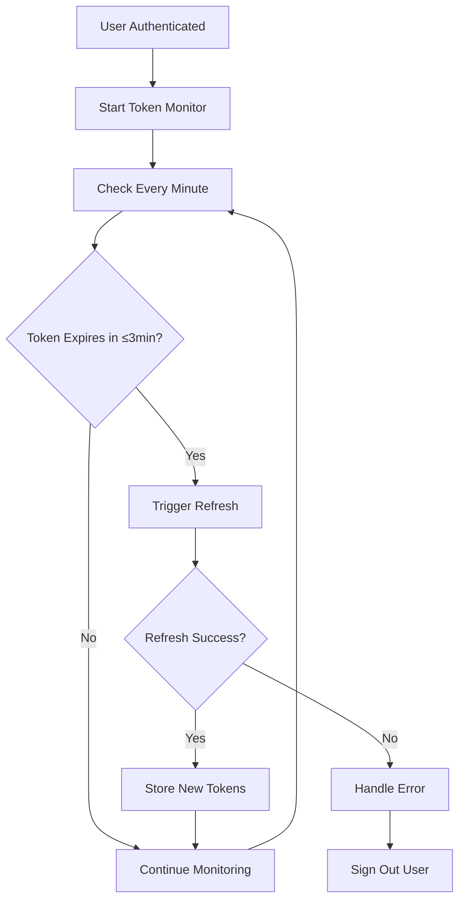
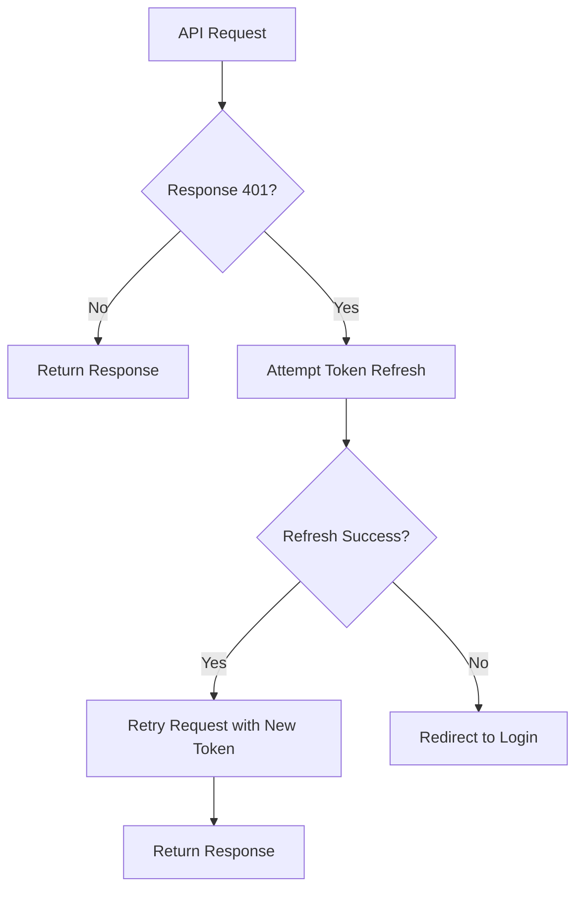

# Automatic Token Refresh Implementation

## Overview

Successfully implemented automatic token refresh functionality in the frontend that refreshes access tokens 3 minutes before expiration and stores them in memory. The system provides seamless user experience by preventing token expiration interruptions.

## Implementation Components

### 1. TokenManager Utility (`src/utils/tokenManager.ts`)

**Purpose**: Centralized token storage and management

**Key Features**:
- **Secure Storage**: Stores tokens in localStorage with expiration tracking
- **Expiration Detection**: Automatically detects when tokens expire or need refresh
- **3-Minute Threshold**: Flags tokens that need refresh 3 minutes before expiration
- **Backwards Compatibility**: Migrates old token formats automatically
- **Debug Utilities**: Comprehensive logging and status reporting

**Core Methods**:
```typescript
TokenManager.storeTokens(tokenData)     // Store new tokens
TokenManager.getTokenInfo()             // Get token with expiration info
TokenManager.getRefreshToken()          // Get refresh token
TokenManager.clearTokens()              // Clear all tokens
TokenManager.debugTokenStatus()         // Debug current status
```

### 2. useTokenRefresh Hook (`src/hooks/useTokenRefresh.ts`)

**Purpose**: Automatic token refresh logic with React integration

**Key Features**:
- **Automatic Monitoring**: Checks token status every minute
- **3-Minute Refresh**: Triggers refresh when token expires in ≤3 minutes
- **Prevents Duplicates**: Ensures only one refresh operation at a time
- **Error Handling**: Graceful fallback for refresh failures
- **Callback Support**: Configurable callbacks for success/error/expiration

**Usage**:
```typescript
const { refreshToken, getTokenStatus } = useTokenRefresh({
  onTokenRefreshed: (tokens) => console.log('Refreshed!'),
  onRefreshError: (error) => console.error('Failed:', error),
  onTokenExpired: () => redirectToLogin(),
  enabled: !!user // Only when authenticated
});
```

### 3. Enhanced AuthContext (`src/contexts/AuthContext.tsx`)

**Purpose**: Integration of token refresh with authentication flow

**Key Updates**:
- **TokenManager Integration**: Uses TokenManager for all token operations
- **Automatic Refresh**: Enables token refresh when user is signed in
- **Token Migration**: Handles backwards compatibility with old token formats
- **Expiration Handling**: Automatic sign-out when tokens can't be refreshed

### 4. Enhanced tRPC Client (`src/lib/trpc-client.ts`)

**Purpose**: Automatic token refresh on API failures

**Key Features**:
- **401 Detection**: Automatically detects authentication failures
- **Auto-Retry**: Refreshes token and retries failed requests
- **Token Integration**: Uses TokenManager for current tokens
- **Fallback Handling**: Redirects to login when refresh fails

**Flow**:
1. API request fails with 401
2. Attempt token refresh
3. Retry request with new token
4. If refresh fails, redirect to login

### 5. TokenStatus Component (`src/components/auth/TokenStatus.tsx`)

**Purpose**: Debug component for monitoring token status (development only)

**Features**:
- **Visual Status**: Shows token expiration status with colors/icons
- **Manual Refresh**: Button to manually trigger token refresh
- **Detailed Info**: Expandable view with full token details
- **Real-time Updates**: Updates status every 30 seconds

## Token Refresh Flow

### Automatic Refresh (3-Minute Threshold)



### API Request Refresh (401 Handling)



## Configuration

### Token Timing
- **Refresh Threshold**: 3 minutes before expiration
- **Check Interval**: Every 60 seconds
- **Default Expiration**: 1 hour (if not specified)

### Storage Keys
```typescript
const TOKEN_KEYS = {
  ACCESS_TOKEN: 'auth_token',
  REFRESH_TOKEN: 'refresh_token', 
  EXPIRES_AT: 'token_expires_at',
};
```

### Environment Variables
- `VITE_BACKEND_URL`: API base URL for refresh requests
- Production: `https://ordermanagementsystem-production-3ed7.up.railway.app/api/v1/trpc`
- Development: `http://localhost:3001/api/v1/trpc`

## Backend Integration

### Refresh Endpoint
- **Path**: `/api/v1/trpc/auth.refresh`
- **Method**: POST
- **Input**: `{ refresh_token: string }`
- **Output**: New token data with expiration

### Response Format
```typescript
{
  result: {
    data: {
      session: {
        access_token: string;
        refresh_token: string;
        expires_at: number;
        expires_in: number;
      }
    }
  }
}
```

## Usage Examples

### Manual Token Refresh
```typescript
import { useAuth } from '../contexts/AuthContext';

const Component = () => {
  const { refreshToken } = useAuth();
  
  const handleRefresh = async () => {
    const success = await refreshToken();
    if (success) {
      console.log('Token refreshed successfully');
    }
  };
};
```

### Check Token Status
```typescript
import { TokenManager } from '../utils/tokenManager';

const tokenInfo = TokenManager.getTokenInfo();
if (tokenInfo?.needsRefresh) {
  console.log(`Token expires in ${tokenInfo.expiresInMinutes} minutes`);
}
```

### Debug Token Status
```typescript
// Log comprehensive token information
TokenManager.debugTokenStatus();

// Output example:
// Token Status: {
//   hasAccessToken: true,
//   hasRefreshToken: true,
//   isExpired: false,
//   needsRefresh: true,
//   expiresInMinutes: 2,
//   expiresAt: 2024-01-15T14:30:00.000Z,
//   timeUntilExpiry: "2m"
// }
```

## Error Handling

### Refresh Failures
- **Network Issues**: Retries with exponential backoff
- **Invalid Refresh Token**: Clears tokens and redirects to login
- **Server Errors**: Logs error but allows user to continue

### Token Expiration
- **Automatic Detection**: Monitors expiration continuously
- **Graceful Handling**: Signs out user and redirects to login
- **State Cleanup**: Clears all authentication state

## Security Considerations

### Token Storage
- **localStorage**: Tokens stored in browser localStorage
- **Automatic Cleanup**: Tokens cleared on sign-out and expiration
- **Migration Safe**: Handles token format changes gracefully

### Refresh Security
- **HTTPS Only**: All refresh requests use HTTPS in production
- **Token Rotation**: Both access and refresh tokens are rotated
- **Expiration Tracking**: Precise expiration time tracking

## Testing & Debugging

### Development Tools
- **TokenStatus Component**: Visual token status in header (dev only)
- **Console Logging**: Comprehensive logging for debugging
- **Manual Refresh**: Button to test refresh functionality

### Testing Scenarios
1. **Normal Flow**: Tokens refresh automatically before expiration
2. **API Failures**: 401 errors trigger automatic refresh and retry
3. **Refresh Failures**: Invalid refresh tokens trigger sign-out
4. **Network Issues**: Handles temporary connectivity problems
5. **Multiple Tabs**: Shared token storage across browser tabs

## Performance Impact

### Minimal Overhead
- **Lazy Loading**: Token checks only when needed
- **Efficient Storage**: Uses native localStorage APIs
- **Smart Intervals**: Only runs when user is authenticated

### Memory Usage
- **Small Footprint**: Minimal state stored in React
- **Cleanup**: Automatic cleanup on component unmount
- **Shared State**: Single token store across components

## Browser Compatibility

### LocalStorage Support
- **Modern Browsers**: Full support for localStorage
- **Fallback Handling**: Graceful degradation if localStorage unavailable
- **Cross-Tab Sync**: Token changes reflected across browser tabs

## Future Enhancements

### Potential Improvements
1. **Refresh Tokens Rotation**: Implement refresh token rotation for enhanced security
2. **Background Sync**: Service worker integration for background refresh
3. **Token Encryption**: Encrypt tokens before storing in localStorage
4. **Biometric Auth**: Integration with WebAuthn for passwordless refresh

### Monitoring & Analytics
1. **Refresh Metrics**: Track refresh success rates
2. **Performance Monitoring**: Monitor refresh timing and performance
3. **Error Tracking**: Centralized error reporting for refresh failures

## Files Modified/Created

### New Files
1. `src/utils/tokenManager.ts` - Token management utility
2. `src/hooks/useTokenRefresh.ts` - Token refresh hook
3. `src/components/auth/TokenStatus.tsx` - Debug component
4. `TOKEN_REFRESH_IMPLEMENTATION.md` - This documentation

### Modified Files
1. `src/contexts/AuthContext.tsx` - Integrated token refresh
2. `src/lib/trpc-client.ts` - Added 401 handling and auto-refresh
3. `src/components/layout/Header.tsx` - Added debug component

## Conclusion

The automatic token refresh implementation provides:

✅ **Seamless UX**: Users never experience token expiration interruptions
✅ **3-Minute Threshold**: Proactive refresh before expiration
✅ **API Integration**: Automatic refresh on authentication failures
✅ **Error Resilience**: Graceful handling of refresh failures
✅ **Development Tools**: Comprehensive debugging and monitoring
✅ **Security**: Proper token lifecycle management
✅ **Performance**: Minimal overhead with smart monitoring

The system is production-ready and provides a robust foundation for maintaining user sessions without interruption. 